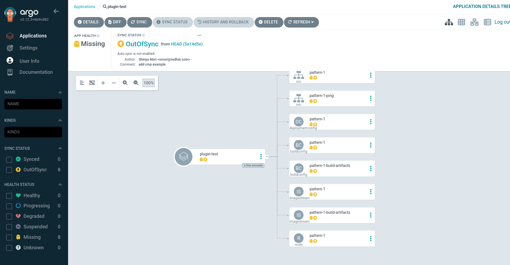
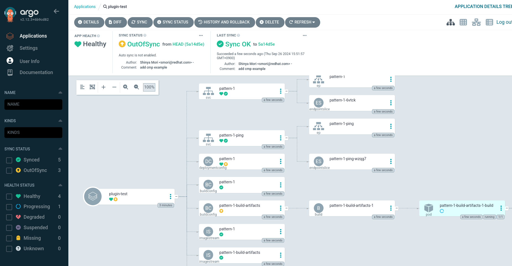

# ArgoCD Config Management Pluginを利用したTemplateのデプロイ
ArgoCD の Config Management Plugin(CMP) を用いてOpenShift Templateをデプロイする方法を示す。

## 事前準備
- OpenShift GitOpsをインストール済みであること

## セットアップ
`gitops-test` namespaceにArgoCDインスタンスを起動し、CMPが利用するコンテナをサイドカーとして起動する。

```
$ oc new-project gitops-test

// アプリが必要なConfigMapを手動作成しておく（アプリとConfigMapの統合は別課題とする）
$ oc create cm cluster-envs --from-literal foo=bar
$ oc create cm cluster-configs --from-literal foo=bar
$ oc create cm app-envs --from-literal foo=bar
$ oc create cm app-configs --from-literal foo=bar
```

ArgoCDとArgoCD Applicationのセットアップ
```
$ oc apply -f argocd/

// argocd-repo-serverのコンテナが2つ起動していること
$ oc get pod
NAME                                  READY   STATUS      RESTARTS   AGE
argocd-application-controller-0       1/1     Running     0          1h 
argocd-dex-server-77c9844c7b-vxlsz    1/1     Running     0          1h 
argocd-redis-5dcb4b8449-gp467         1/1     Running     0          1h 
argocd-repo-server-69f687779c-5kwl6   2/2     Running     0          1h 
argocd-server-f4fbfb677-96n5p         1/1     Running     0          1h 

```

### 設定のポイント
#### ArgoCDリソース
```yaml
apiVersion: argoproj.io/v1beta1
kind: ArgoCD
metadata:
  name: argocd
  namespace: gitops-test
spec:
  ...
  repo:
    sidecarContainers:
      - name: my-plugin
        # 起動時に自動で埋め込まれるためこのままでいい
        command: [/var/run/argocd/argocd-cmp-server]
        # imageは任意でよい。Templateを展開するためにはocコマンドがインストールされていること。
        image: image-registry.openshift-image-registry.svc:5000/openshift/cli
        volumeMounts:
          - mountPath: /var/run/argocd
            name: var-files
          - mountPath: /home/argocd/cmp-server/plugins
            name: plugins
          # Pluginの設定をマウント
          - mountPath: jconfig/plugin.yaml
            subPath: plugin.yaml
            name: cmp-plugin
    # Pluginの設定
    volumes:
      - configMap:
          name: my-plugin-config
        name: cmp-plugin
```

#### プラグイン設定
プラグインの構造として`init`, `generate`, `parameters` の概要を理解するとよい。  
単純にTemplateを展開するのみであれば `init` は不要。
`parameters`に記載の `param-file` は `Application`リソースで設定可能。

```yaml
apiVersion: v1
kind: ConfigMap
metadata:
  name: my-plugin-config
data:
  plugin.yaml: |
    apiVersion: argoproj.io/v1alpha1
    kind: ConfigManagementPlugin
    metadata:
      name: my-plugin
    spec:
      version: v1.0
      init:
        command:
          - sh
          - -c
          - "echo 'Initializing...'"
      generate:
        command:
          - sh
          - -c
          - "oc process --param-file=$PARAM_PARAMS_FILE -f . -o yaml --local"
      discover:
        fileName: "./*.yaml"
      parameters:
        static:
          - name: params-file
            title: Parameters file
            required: true

```

#### アプリケーション
```yaml
apiVersion: argoproj.io/v1alpha1
kind: Application
metadata:
  name: plugin-test
spec:
  project: default
  destination:
    namespace: gitops-test
    server: https://kubernetes.default.svc
  source:
    repoURL: https://github.com/mosuke5/openshift-gitops-pattern
    targetRevision: HEAD
    path: app-deploy-with-template/argocd-cmp
    # 以下がプラグイン設定
    plugin:
      # 次の命名になる: [plugin]-[version]
      name: my-plugin-v1.0
      parameters:
        # どのパラメータファイルを使ってTemplateを展開するか
        - name: params-file
          string: params/pattern-1.env
```

## アプリケーションデプロイ
以下の通りアプリケーションが作成されている。まだSync（デプロイ前）


"Sync"ボタンを押してSyncすると、マニフェストの適用が行われる。


## ノウハウ
- Plugin設定のConfigMapを変更したあとは `argocd-repo-server` Podを削除し再起動する必要がある
- Applicationリソースのプラグイン名がうまく認識されない場合は、argcd-repo-serverのサイドカーコンテナ内に入って、プラグイン名を確認するといい。以下の場合、`my-plugin-v1.0` がプラグイン名となる。

```
$ oc exec -it argocd-repo-server-69f687779c-5kwl6 -c my-plugin  -- ls -l /home/argocd/cmp-server/plugins
total 0
srwxr-xr-x. 1 1001030000 1001030000 0 Sep 25 14:18 my-plugin-v1.0.sock
```